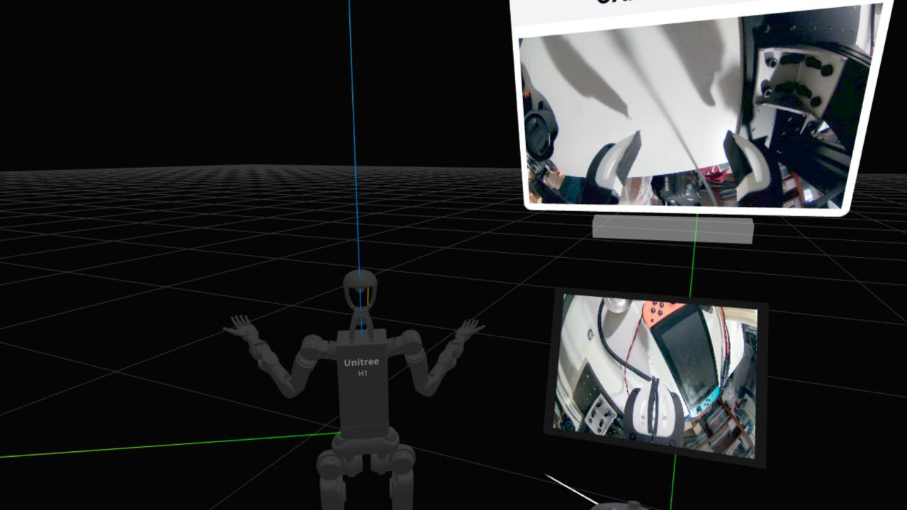

# TeleopXR



**TeleopXR** transforms your VR/AR headset into a powerful, precise robot controller. It provides a lightweight, installation-free teleoperation interface with low-latency video streaming and full WebXR state tracking.

## Key Features

*   **🕶️ VR/Passthrough**: Seamlessly switch between fully immersive VR and high-fidelity AR Passthrough modes, allowing you to choose between total focus and situational awareness.
*   **📡 WebRTC Video Streaming**: Get ultra-low latency, real-time video feedback directly in the headset, providing a near-instantaneous visual link to your robot's perspective.
*   **🤖 Robot Visualization**: Benefit from real-time 3D visualization of the robot model, ensuring your digital twin is always perfectly synchronized with the physical robot's state.
*   **🕹️ Realtime Teleoperation based on Whole-Body IK**: Achieve precise and intuitive control through advanced Whole-Body Inverse Kinematics, enabling complex coordination with minimal effort.


## 🚀 Quick Start (Demo)

Use the built-in demo to verify connectivity and visualize the XR state data in real-time.

### Installation

**Basic installation (teleop mode only):**
```bash
pip install teleop-xr
```

**With IK support (recommended):**

The IK solver requires additional dependencies that must be installed separately:

```bash
pip install "teleop-xr[ik]"
```

### Running the Demo

```bash
python -m teleop_xr.demo
```

### Modes

The demo supports two operation modes:

*   **Teleop Mode (Default)**: Visualizes raw XR state data and button events.
    ```bash
    python -m teleop_xr.demo --mode teleop
    ```
*   **IK Mode**: Enables the high-performance IK solver (configured for Unitree H1 by default). **Requires IK dependencies installed.**
    ```bash
    python -m teleop_xr.demo --mode ik
    ```

### Usage

1. Open the displayed URL (`https://<ip>:4443`) in your headset.
2. Enter VR mode.
3. Observe the live state data and event logs in your terminal.

## 📖 Documentation

For detailed guides on integrating TeleopXR into your own projects, including the **Generic Python API** and **ROS2 Interface**, please visit our official documentation website:

👉 **[https://qrafty-ai.github.io/teleop_xr/generic/](https://qrafty-ai.github.io/teleop_xr/generic/)**

## Development

For developers contributing to TeleopXR or customizing the frontend:

### Prerequisites
*   Python 3.10+ with pip
*   [uv](https://github.com/astral-sh/uv) (recommended for development)
*   Node.js & npm (for WebXR frontend)

### Setup

1.  **Clone the repository:**
    ```bash
    git clone https://github.com/qrafty-ai/teleop_xr.git
    cd teleop_xr
    ```

2.  **Install Python dependencies:**

    **Option A: Using uv (recommended)**
    ```bash
    uv sync
    ```

    **Option B: Using pip**
    ```bash
    pip install -e .
    # For IK support:
    pip install git+https://github.com/chungmin99/pyroki.git
    pip install git+https://github.com/chungmin99/ballpark.git
    ```

3.  **Build the WebXR frontend:**
    ```bash
    cd webxr
    npm install
    npm run build
    ```
    *(The build output will be used by the Python server)*

4.  **Run from source:**
    ```bash
    # From the root directory
    # With uv:
    uv run python -m teleop_xr.demo

    # Or with pip:
    python -m teleop_xr.demo
    ```

### Note on IK Dependencies

The IK solver requires `pyroki` and `ballpark`, which are not on PyPI. During development with `uv`, these are automatically installed from git. For pip-based installations, install them manually from GitHub as shown above.

## Acknowledgments

This project is forked from [SpesRobotics/teleop](https://github.com/SpesRobotics/teleop). We are grateful for their foundational work in creating a WebXR-based teleoperation solution.

We also leverage powerful libraries for robotics:

-   [**Pyroki**](https://github.com/chungmin99/pyroki): For high-performance, differentiable Inverse Kinematics and collision checking.
-   [**Ballpark**](https://github.com/chungmin99/ballpark): For robust collision geometry generation and sphere decomposition.

## License

This project is licensed under the **Apache License 2.0**. See the [LICENSE](https://github.com/qrafty-ai/teleop_xr/blob/main/LICENSE) file for details.
