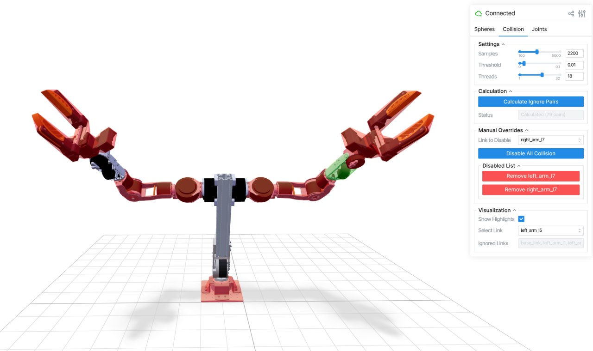

# Sphere-Based Collision Support

TeleopXR uses sphere-based collision checking to provide high-performance,
differentiable signed distance fields (SDF) for Inverse Kinematics. This
approach is superior to primitive mesh collision (like boxes or capsules) for
complex robot geometries as it allows the optimizer to smoothly "push" links
away from each other and the world.

## 1. Generating Collision Data

The `scripts/configure_sphere_collision.py` utility is an interactive GUI built
with [Viser](https://github.com/nerfstudio-project/viser) that helps you
generate a `collision.json` file for your robot.

### Running the Script

Run the script specifying your robot class (as registered in entry points or
module path):

```bash
python scripts/configure_sphere_collision.py --robot-class "my_robot"
```

### Phase 1: Sphere Generation

In the **Spheres** tab, you configure the volumetric approximation of your
robot:

1. **Allocation**: Choose between **Auto** (distributes spheres based on
   volume) or **Manual** (fine-tune per-link budgets).
2. **Spherize**: Run the generation. This places spheres to cover the
   collision meshes of each link.
3. **Refine**: (Optional) Run the optimization to tighten the sphere coverage
   and minimize overlaps.


### Phase 2: Collision Pair Calculation

Once spheres are generated, move to the **Collision** tab to identify which
link pairs should be checked for collision.

1. **Settings**:
    - **Samples**: Number of random configurations to test (default 1000).
    - **Threshold**: Minimum clearance margin (default 0.01m).
    - **Threads**: Number of parallel processes for calculation.
2. **Calculation**: Click **Calculate Ignore Pairs**. The script identifies
    pairs that:
    - **Always collide**: Structural components or adjacent links that
      provide no useful signal.
    - **Never collide**: Links that, within their joint limits, never come
      close enough to touch.
3. **Manual Overrides**: You can manually disable collision checking for
    specific links if you know they are safe (e.g., small decorative parts).



### Export

Enter the desired filename (default `collision.json`) and click **Export to
JSON**. Save this file in your robot's asset directory.

---

## 2. Integrating with Robot Class

To use the generated data in the IK solver, update your robot class (inheriting
from `BaseRobot`) to load and pass the data to `pyroki`.

### Implementation Example

The following pattern can be used in your robot class:

```python
import os
import json
import pyroki as pk
from teleop_xr.ik.robot import BaseRobot

class MyRobot(BaseRobot):
    def __init__(self, urdf_string: str | None = None, **kwargs):
        # ... load URDF ...

        # Load sphere and ignore pair data
        collision_data = self._load_collision_data()

        if collision_data is not None:
            sphere_decomposition, ignore_pairs = collision_data
            self.robot_coll = pk.collision.RobotCollision.from_sphere_decomposition(
                sphere_decomposition,
                urdf,
                user_ignore_pairs=ignore_pairs,
                ignore_immediate_adjacents=True,
            )
        else:
            # Fallback to standard URDF primitive collision
            self.robot_coll = pk.collision.RobotCollision.from_urdf(urdf)

    @staticmethod
    def _load_collision_data():
        """Helper to load collision.json or fallback to sphere.json"""
        import os, json
        # Adjust path to your asset directory
        asset_dir = os.path.join(
            os.path.dirname(os.path.abspath(__file__)),
            "assets",
            "my_robot"
        )

        collision_path = os.path.join(asset_dir, "collision.json")
        sphere_path = os.path.join(asset_dir, "sphere.json")

        try:
            if os.path.exists(collision_path):
                with open(collision_path, "r") as f:
                    data = json.load(f)
                spheres = data["spheres"]
                ignore_pairs = tuple(
                    tuple(pair) for pair in data.get("collision_ignore_pairs", [])
                )
                return spheres, ignore_pairs

            if os.path.exists(sphere_path):
                with open(sphere_path, "r") as f:
                    data = json.load(f)
                return data, ()

        except (json.JSONDecodeError, IOError, KeyError):
            pass

        return None
```

### Key Components

- **`from_sphere_decomposition`**: Tells `pyroki` to use your custom spheres
  for SDF calculation.
- **`user_ignore_pairs`**: Provides the list of links to exclude from
  collision checks, significantly improving performance.
- **`ignore_immediate_adjacents`**: When `True`, automatically ignores
  parent-child link pairs defined in the URDF.
